# Goya Zheng - Portfolio Task

[My portfolio site](goyadev.github.io)

## Project Requirements

### Content

This website is a portfolio website to showcase my coding and development work. The website features an index page, bio page, projects page and a contact page with a functional contact form and links to my Github and LinkedIn.

- [x] At least one profile picture
- [x] Biography (at least 100 words)
- [x] Functional Contact Form
- [x] "Projects" section
- [x] Links to external sites, e.g. GitHub and LinkedIn.

### Technical

There are four pages on this website: index, bio, projects and contact. They are version controlled using Git (through the terminal!) and it has been deployed to GitHub pages. It is responsive on mobile and desktop. It was made with a 'mobile first' approach to design.

- [x] At least 2 web pages.
- [x] Version controlled with Git
- [x] Deployed on GitHub pages.
- [x] Implements responsive design principles.
- [x] Uses semantic HTML.

### Bonus (optional)

There is a style for active links where it changes to blue, hover state where it changes to pink. No JavaScript was added at this point in time, but I would like to add it in the future.

- [x] Different styles for active, hover and focus states.
- [x] Include JavaScript to add some dynamic elements to your site. (Extra
      tricky!)

### Screenshots

#### Screenshots - Mobile

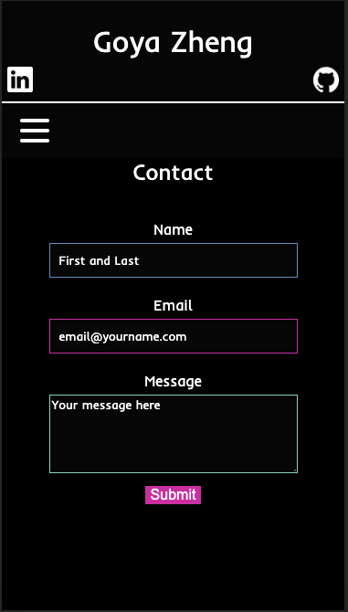
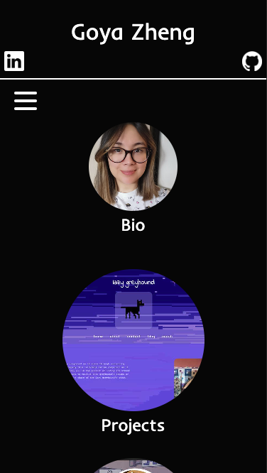
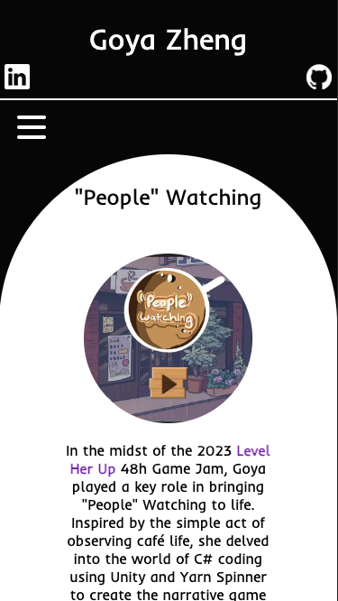

#### Screenshots - Tablet

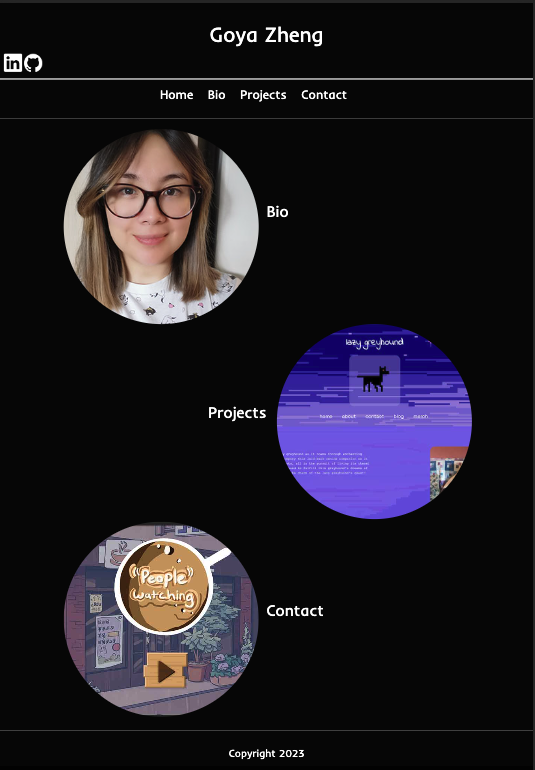

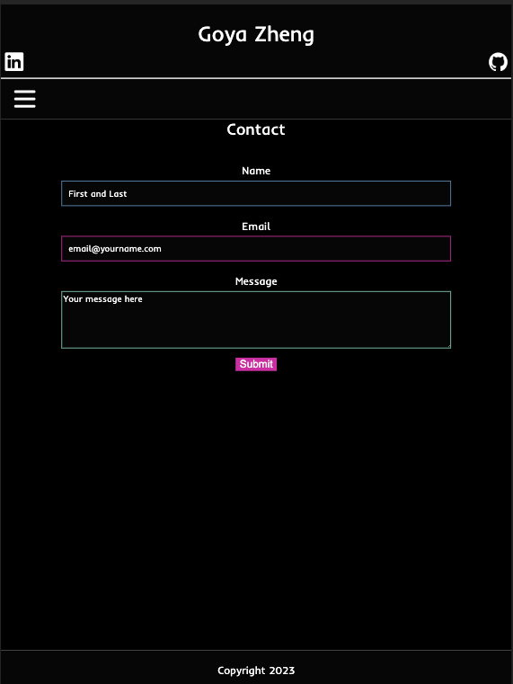
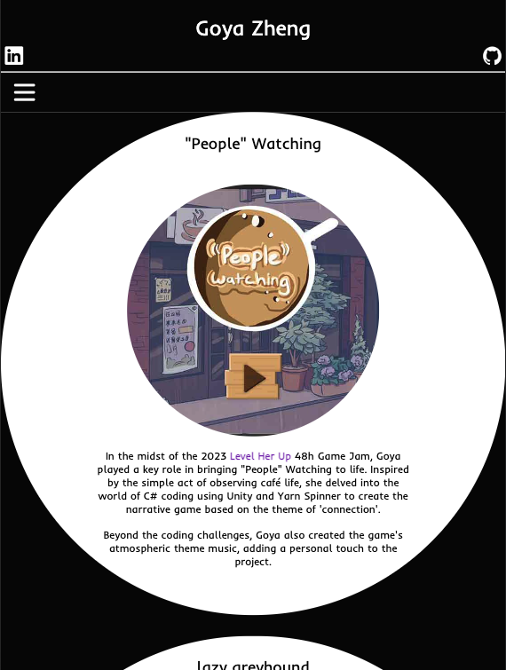

#### Screenshots - Desktop

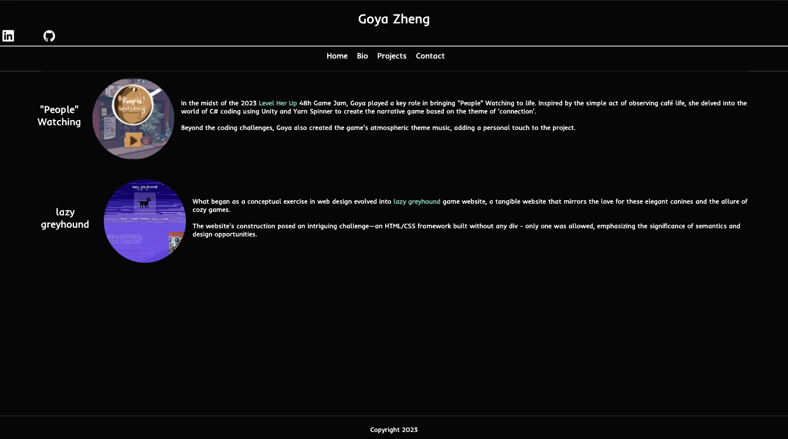
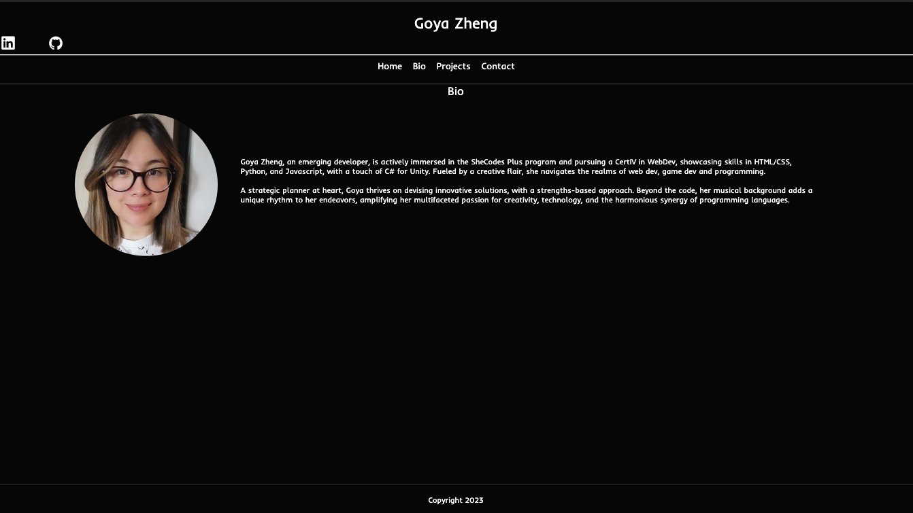
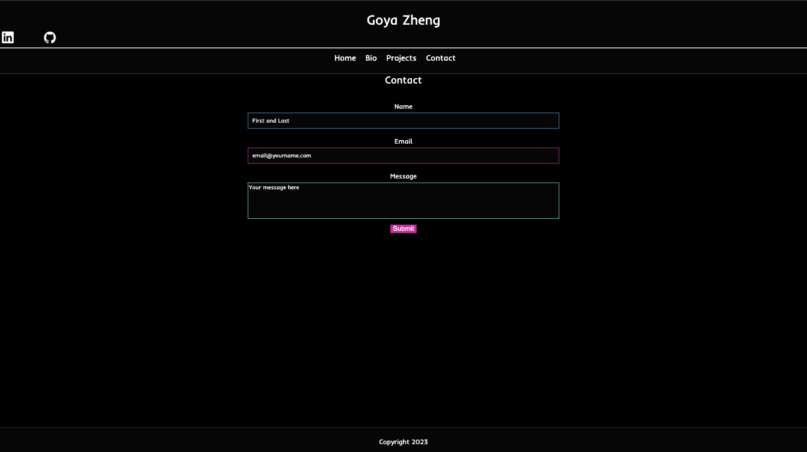
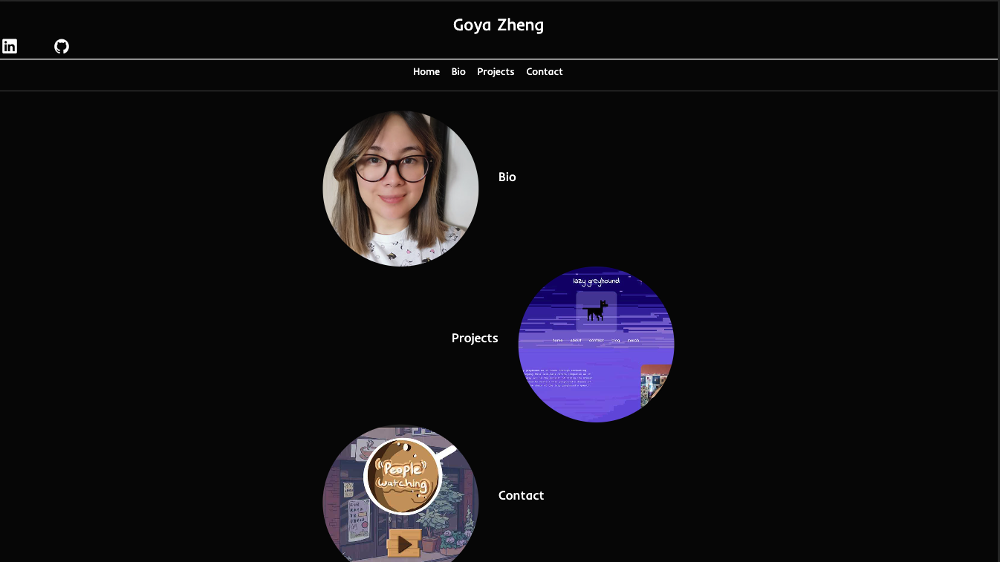

#### Screenshots - Link States

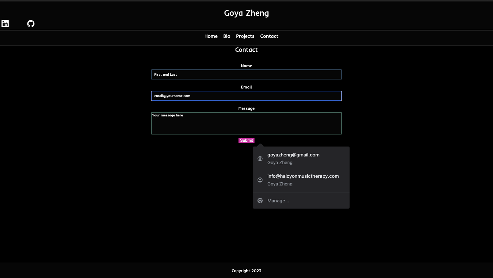
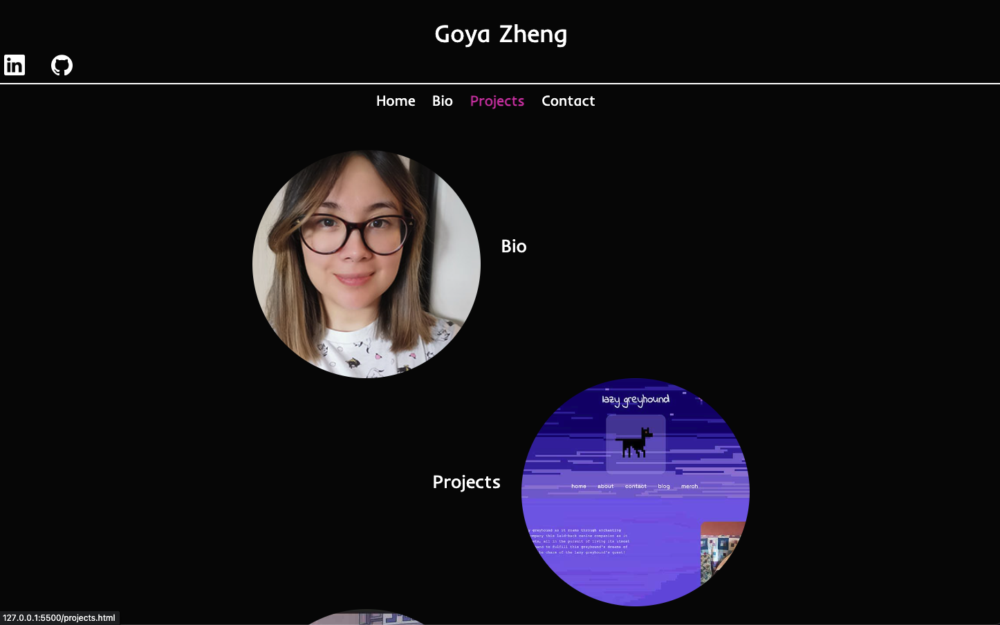

#### Wireframes

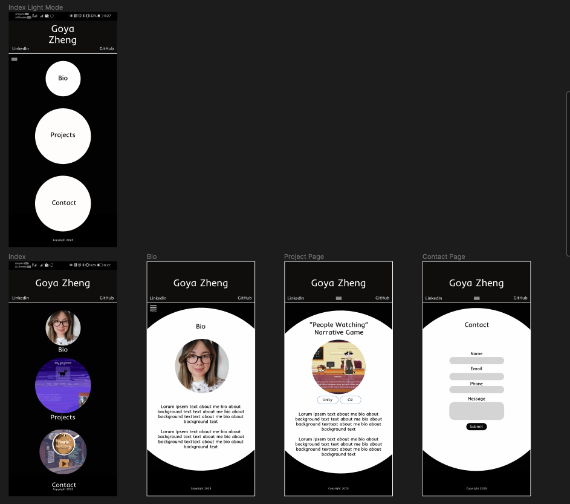
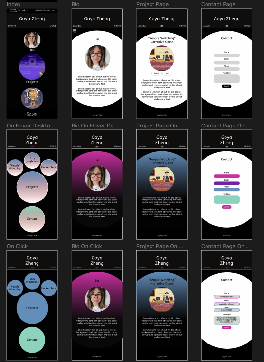
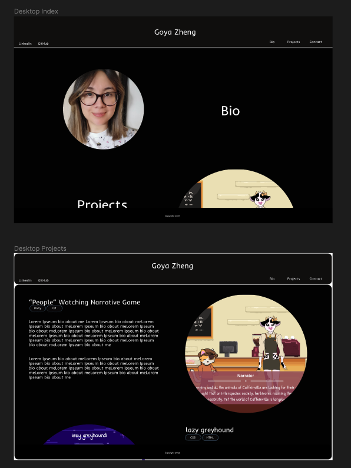
